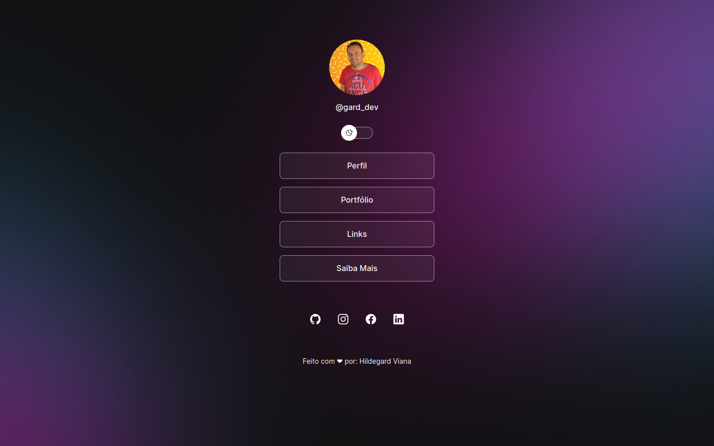
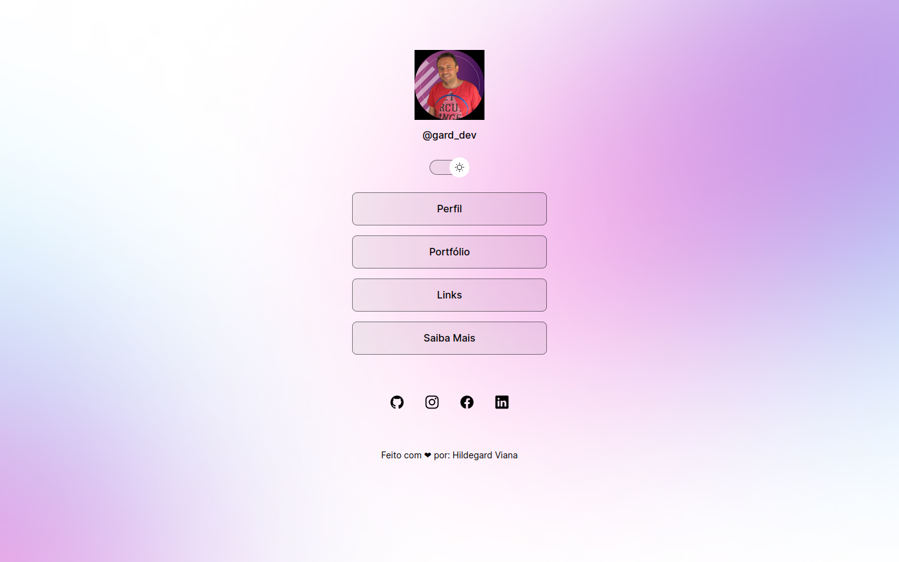

<h1 align="center">Meus Projetos </h1>

<h2> 🧠 Meus Links</h2>

 💻 Esse é um projeto de uma landing page pessoal.

<h2> 🚀 Tecnologias Utilizadas</h2>
<h3>

 ✨ HTML

 ✨ CSS

 ✨ Javascript

</h3>
<h2> 📺 Preview</h2>

<h2> ♟ Objetivo</h2>

O objetivo desse projeto é treinar habilidade básicas de front end e ir criando um portfólio no github.

